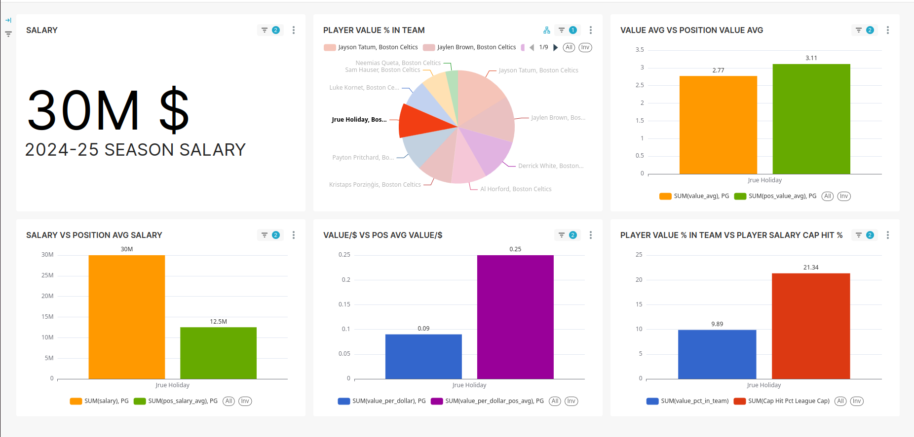
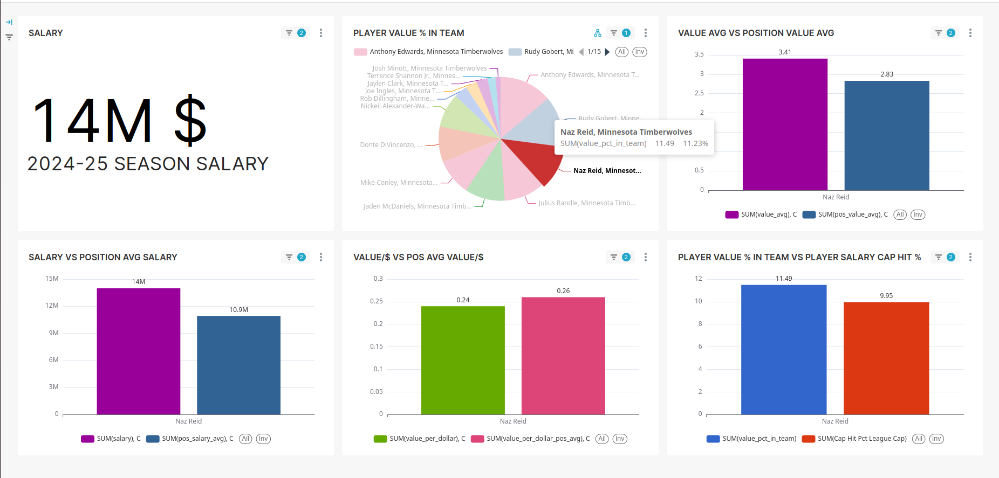

Copyright 2025 KoAt-DA. All Rights Reserved.

# NBA Player Value Analysis Pipeline

## Overview

This automated ETL pipeline analyzes NBA player performance vs. salary to identify over- and underpaid players, using Apache Airflow for 4-hourly updates, PostgreSQL for storage, and Superset for interactive dashboards. Built with Python and nba_api, it delivers actionable insights with fresh 2024-25 season data.

## Features

### Data Collection & Processing
- Extracts player and team statistics using nba_api and loads them into structured PostgreSQL tables for downstream processing.

- Implements a local caching mechanism using Python's pickle module to avoid exceeding the rate limits of the NBA API.

- Standardizes team names and abbreviations.

- Combines performance metrics with salary data for comprehensive analysis.

## Features
- **Automated Workflow**: Airflow orchestrates the pipeline, running every 4 hours for near real-time updates.
- **Data Collection**: Fetches player stats, salaries, and team data via nba_api with local caching to handle API rate limits.
- **Key Metrics**: Calculates Player Value Average, Value per Dollar, position-based averages, and team value distribution.
- **Visualization**: Superset dashboards show player value trends, filterable by team and player.
- **Insights**:
  - Jrue Holiday contributes 9.89% of the Boston Celtics' value, exceeding his 21.34% salary cap hit, indicating potential overvaluation.
  - Naz Reid contributes 11.09% of the Minnesota Timberwolves' value, exceeding his 9.95% salary cap hit and his value per dollar( 0.56 ) is higher than his position averages ( 0.37 ), so he looks undervalued

## Key Metrics
- **SUM(value_avg)**: Average player value based on performance stats (e.g., PER, points).
- **SUM(value_per_dollar)**: Efficiency metric (value per dollar of salary).
- **SUM(value_pct_in_team)**: Player's value as a percentage of the team's total value.

### Output & Visualization
- Generates a CSV file with processed metrics.

- Uploads results to PostgreSQL database for further use.

- Creates comprehensive player value analysis.

- Visualizes the results in Apache Superset through interactive dashboards.

## Usage
- Ensure Airflow is running on your system.

- Access the Airflow UI at http://localhost:8080 to monitor and manage DAG execution.

- The pipeline runs automatically, fetching and processing data according to the scheduled intervals.

## Data Flow

- Extract: Fetch data from NBA_API.

- Transform:

    - Clean player names.

    - Calculate performance metrics based on player stats.

    - Compute salary-based analytics.

- Load: Upload processed data to PostgreSQL for storage and further analysis.

## Tech Stack
- Python (data processing, API interaction)

- PostgreSQL (data storage)

- Apache Airflow (workflow orchestration)

- Apache Superset (data visualization)

- nba_api (data source)

- Pandas, Pickle (data manipulation and caching)

## Screenshots
  
*Jrue Holiday's value analysis, highlighting his contribution to the Boston Celtics.*

  
*Naz Reid's value analysis, showing his contribution to the Minnesota Timberwolves.*

## Motivation
The project was inspired by the hypothesis that some NBA players might be significantly overpaid or underpaid relative to their on-court contributions. This end-to-end pipeline was designed to validate that idea with real data and modern data engineering tools

## Authors

KoAt-DA

